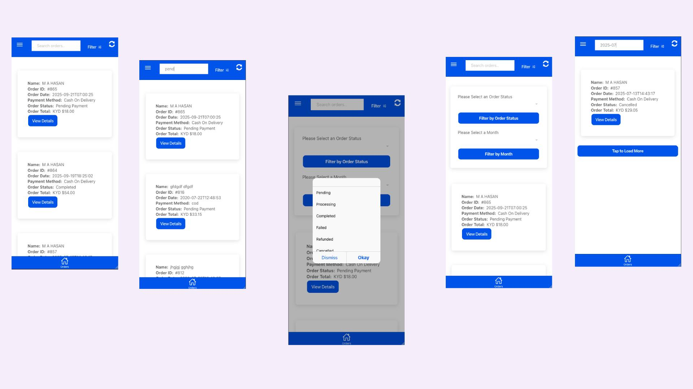
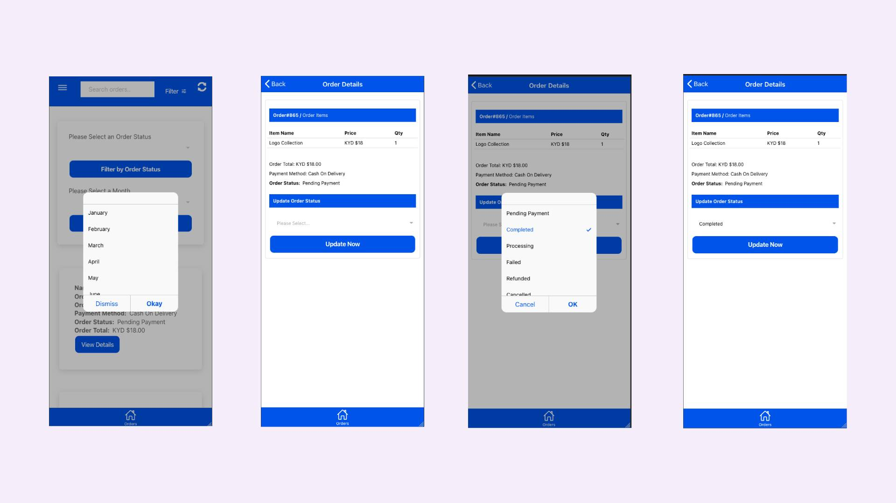

# 🛍️ WooCommerce Admin Order Manager App (Ionic + Angular)

### Hybrid Mobile Dashboard for Android, iOS & PWA

A **free and open-source WooCommerce Order Management App** built with **Ionic + Angular**, designed for store owners and admins to **view, search, filter, and manage WooCommerce orders** anytime, anywhere.

This lightweight hybrid app seamlessly connects with your **WordPress + WooCommerce store** through the official **WooCommerce REST API**, making order management simple and accessible for everyone.


---

## 🚀 Features

* 🔐 **Login** with WordPress/WooCommerce administrator credentials
* 📦 **View All Orders** in a responsive mobile interface
* 🔎 **Search Orders** by customer name, email, or order ID
* 📅 **Filter Orders** by date range and order status (Pending, Processing, Completed, etc.)
* 📖 **View Order Details** including products, billing & shipping info
* 🔄 **Change Order Status** directly from the app
* 🔑 Uses **JWT Authentication** for secure login
* 📱 Built with **Ionic Framework** and **Angular**

---

## 📱 Ideal Use Cases

* WooCommerce store administrators managing orders on the go
* Shop managers who need quick access to customer orders
* Delivery teams updating order statuses in real time
* Headless WooCommerce admin panel replacement
* Hybrid mobile order management app with Ionic + Angular

---

## 🛠️ Tech Stack

* ✅ **Ionic Framework (Angular)**
* ✅ **WooCommerce REST API**
* ✅ **WordPress REST API**
* ✅ **JWT Authentication plugin** for WordPress
* ✅ **Capacitor** for Android/iOS builds

---

## 📦 Installation & Setup

1. **Clone this repo:**

   ```bash
   git clone https://github.com/YOUR_USERNAME/WooCommerce-Admin-Order-Manager-App-Ionic-Angular-Dashboard.git
   cd WooCommerce-Admin-Order-Manager-App-Ionic-Angular-Dashboard
   ```

2. **Install dependencies:**

   ```bash
   npm install
   ```

## Screenshot





## 🙌 Author

**M A Hasan**
- 🔭 Full-Stack Web Developer | Ionic Framework, Angular, Node.js & REST APIs
- 🌐 About Me [https://hasan.online](https://hasan.online)
- 🎓 Instructor on [Udemy](https://www.udemy.com/user/m-a-hasan-2/)
- 🧠 Creator at [Envato](https://themeforest.net/user/hasanonline)
- ✍️ Blogger at [blog.hasan.online](https://blog.hasan.online)

---

## ⭐ Support This Project

If you find this useful:

* ⭐ Star the repository on GitHub
* 🔗 Share it with WooCommerce, WordPress, and Ionic developers
* 💡 Contribute with issues, ideas, or pull requests

> Together, let’s make WooCommerce more mobile-friendly 🚀
